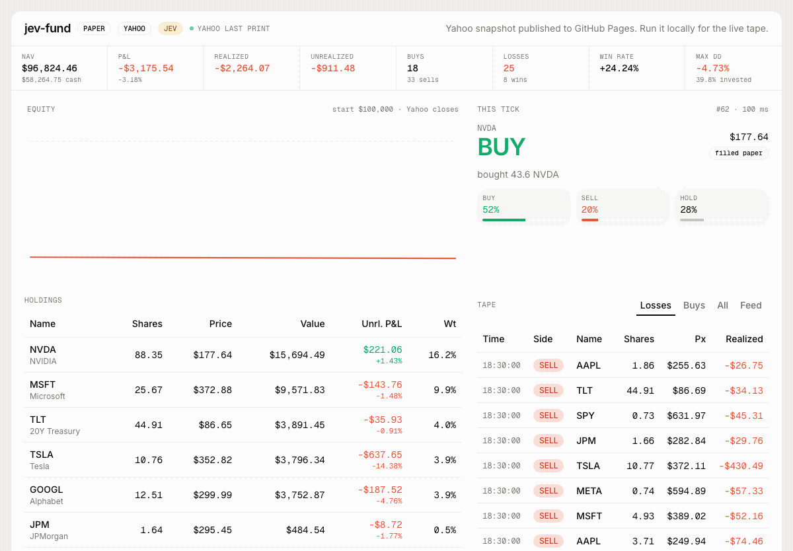
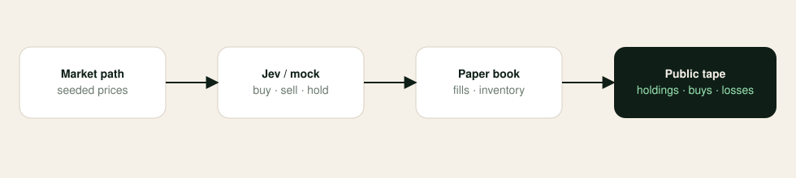
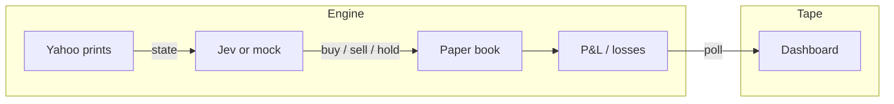

<p align="center">
  
</p>

<p align="center">
  <b>An open-source paper hedge fund.</b><br />
  Jev decides. The tape shows holdings, buys, and losses.
</p>

<p align="center">
  <a href="https://github.com/erboland/jev-fund/actions/workflows/ci.yml"></a>
  <a href="LICENSE"></a>
  
  
  
  
  <a href="https://github.com/erboland/jev-fund/stargazers"></a>
  <a href="https://x.com/karshigaerbol"></a>
</p>

<p align="center">
  <a href="DISCLAIMER.md">Disclaimer</a> ·
  <a href="#news">News</a> ·
  <a href="#demo">Demo</a> ·
  <a href="#installation">Installation</a> ·
  <a href="#framework">Framework</a> ·
  <a href="#citation">Citation</a>
</p>

---

# jev-fund: Open-Source Paper Hedge Fund

A proof of concept for an AI-powered **paper** hedge fund. [Jev](https://vercel.com/kb/guide/typesafe-jev-and-ai-sdk) (TypeSafe System One, via the Vercel AI SDK) answers buy / sell / hold on a $100k long-only book. The public page is the tape: holdings, buys, and losses.

> [!IMPORTANT]
> This project is for **educational and research purposes only**. It does not place live orders. It is not investment advice. Read [DISCLAIMER.md](DISCLAIMER.md).

> 🎉 **jev-fund** is open source. Fork it, run it keyless, and keep the Losses tab honest.

## News

- **[2026-09] v0.1.2** — GitHub Pages serves a static Yahoo-marked book. See [the site](https://erboland.github.io/jev-fund/).
- **[2026-09] v0.1.1** — Paper book marks to **real Yahoo Finance** daily history and last print. Still paper fills only.
- **[2026-09] v0.1.0** — Public paper book: holdings, buys, realized losses, Jev or mock, MIT + citation. See [CHANGELOG.md](CHANGELOG.md).
- **[2026-09] Roadmap** — Persistence. See [ROADMAP.md](ROADMAP.md).

<div align="center">

🚀 [Framework](#framework) | ⚡ [Installation](#installation) | 🎬 [Demo](#demo) | 🤝 [Contributing](#contributing) | 📄 [Citation](#citation)

</div>

## Disclaimer

This software is a **research toy**. By using it you agree:

- Not intended for real trading or investment
- No investment advice, solicitation, or performance guarantee
- Yahoo Finance prices (typically delayed) and **paper fills only** — **losses are shown on purpose**
- Past paper P&L on Yahoo prints does not indicate future results
- The authors assume no liability for financial losses
- Consult a licensed advisor before investing real capital

Do not connect a brokerage, wallet, or private key to this repository.

## Demo

<p align="center">
  
</p>

| | |
| --- | --- |
| Local | `npm run dev` → [http://127.0.0.1:43147](http://127.0.0.1:43147) |
| GitHub Pages | [erboland.github.io/jev-fund](https://erboland.github.io/jev-fund/) (live) |
| Custom domain | [fund.qinvesting.ai](https://fund.qinvesting.ai/) — optional; see [Deploy](#deploy) |
| Dashboard | Holdings, buys, realized **losses**, equity curve, this-tick probabilities |
| Default model | Deterministic **mock** (no API key) on **real Yahoo prices** |
| Optional model | `MODEL=jev` via Vercel AI Gateway / TypeSafe |
| Market data | Yahoo Finance daily history + last print (delayed). No quote API key. |

What you are looking at:

| Panel | Meaning |
| --- | --- |
| NAV / P&L | Mark-to-model value vs the $100k start, including losses |
| Equity | Paper NAV after each tick |
| This tick | Latest Jev (or mock) choice and probabilities |
| Holdings | Open lines, weight, unrealized P&L |
| Tape → Losses / Buys | Realized losing sells, and the buy blotter |

Every ~4 seconds the local engine looks at one name in a 10-ticker universe, sizes a paper order, and prints the tape.

GitHub Pages is a static export of that book. Actions rebuilds it on every push to `main` and hourly, marking the paper book to Yahoo at build time. Set the `AI_GATEWAY_API_KEY` Actions secret to let that build ask Jev once; otherwise the published book uses the keyless mock. The 4-second tape, including live Jev, stays on `npm run dev`.

## Installation

```bash
git clone https://github.com/erboland/jev-fund.git
cd jev-fund
npm install
cp .env.example .env.local
npm run dev
```

Open [http://127.0.0.1:43147](http://127.0.0.1:43147). No API keys required.

### Optional: real Jev

```bash
# .env.local
MODEL=jev
AI_GATEWAY_API_KEY=...          # or TYPESAFE_AI_API_KEY / Vercel OIDC
```

If Jev is unreachable, the fund falls back to mock so the page never goes blank.

### Scripts

| Command | |
| --- | --- |
| `npm run dev` | Dev server on port 43147 |
| `npm test` | Paper-fund checks (holdings, buys, and losses exist) |
| `npm run lint` | ESLint |
| `npm run build` | Production build |
| `npm start` | Serve the build on 43147 |

## Framework

jev-fund decomposes a fund tick the way a small desk would: a market, a decision, a book, and a public tape.

<p align="center">
  
</p>



| Role | What it does |
| --- | --- |
| **Market** | Yahoo Finance daily closes, then last print (delayed) |
| **Jev / mock** | Scores one ticker per tick: buy, sell, or hold |
| **Paper book** | Clip size ~8% of NAV, cap ~22% per name, cash long-only |
| **Tape** | Holdings, buy blotter, and realized **losses** in public |

1. Yahoo daily history is aligned across the 10-name universe.
2. The paper book trades that path at real closes, then marks to the latest Yahoo print.
3. Each tick, one name is scored: momentum, inventory, and (optionally) Jev `experimental_evaluate`.
4. Buys are capped. Sells realize P&L, including losses.
5. The Next.js page polls `/api/fund` and renders the book.

> The framework is designed for research. Paper P&L on delayed Yahoo prints is not live trading performance. It is not financial, investment, or trading advice.

### Universe

| Ticker | Name |
| --- | --- |
| AAPL | Apple |
| MSFT | Microsoft |
| NVDA | NVIDIA |
| GOOGL | Alphabet |
| AMZN | Amazon |
| META | Meta |
| TSLA | Tesla |
| JPM | JPMorgan |
| SPY | S&P 500 ETF |
| TLT | 20Y Treasury |

## Layout

```
src/lib/quotes.ts     Yahoo Finance daily + last print
src/lib/fund.ts       paper book, fills, P&L
src/lib/model.ts      mock + Jev (`experimental_evaluate`)
src/lib/runtime.ts    in-memory live loop
src/app/api/fund    snapshot JSON
src/components/       dashboard
docs/assets/          logo, schema, demo recording
docs/launch/          X, Hacker News, Reddit copy
DISCLAIMER.md         research-toy terms
CHANGELOG.md          release notes
ROADMAP.md            what this desk will and will not do
CITATION.cff          GitHub citation file
```

**jev-fund** is a watchable paper book: a browser, a blotter, and honest losses. It is not a broker, and not the QInvesting production engine.

Built as an open artifact of [QInvesting](https://qinvesting.ai). Follow [**@karshigaerbol**](https://x.com/karshigaerbol).

## Deploy

[GitHub Pages](https://erboland.github.io/jev-fund/) publishes the static book from `.github/workflows/pages.yml` on every push to `main` and hourly. Pages source must be **GitHub Actions** (repo settings → Pages).

### Custom domain (`fund.qinvesting.ai`)

The apex domain [qinvesting.ai](https://qinvesting.ai) already points at Vercel, so use a subdomain for this demo:

1. **DNS** (at your registrar or Vercel DNS): `CNAME fund → erboland.github.io`
2. **GitHub** → Settings → Pages → Custom domain: `fund.qinvesting.ai` (enforce HTTPS)
3. **Repo variable** `PAGES_CNAME` = `fund.qinvesting.ai` (Settings → Secrets and variables → Actions → Variables). The next Pages build exports at the site root and writes `out/CNAME`.
4. Re-run the **Pages** workflow.

Until step 3 runs, keep using the [github.io URL](https://erboland.github.io/jev-fund/). Moving the apex off Vercel to GitHub Pages would require replacing the main `qinvesting.ai` site, not just this repo.

A Node host that stays warm still runs the live 4-second tape (`npm start`). On Vercel the book rebuilds on cold start from Yahoo daily history, then continues from the latest print per isolate.

## Contributing

See [CONTRIBUTING.md](CONTRIBUTING.md). Please keep PRs small. Paper P&L must stay honest — do not hide losing sells from the Losses tape.

<a href="https://github.com/erboland/jev-fund/graphs/contributors">
  
</a>

## Citation

If this tape is useful in a write-up, please cite the repository:

```bibtex
@software{karshyga2026jevfund,
  author  = {jev-fund contributors},
  title   = {jev-fund: an open-source paper hedge fund},
  year    = {2026},
  url     = {https://github.com/erboland/jev-fund},
  license = {MIT}
}
```

Also see [CITATION.cff](CITATION.cff).

## Star history

[](https://star-history.com/#erboland/jev-fund&Date)

## License

[MIT](LICENSE). See [NOTICE](NOTICE). Not affiliated with TypeSafe or Vercel.

**Disclaimer:** we are sharing this code for academic and demonstration purposes under the MIT license. Nothing herein is financial advice or a recommendation to trade real money.
