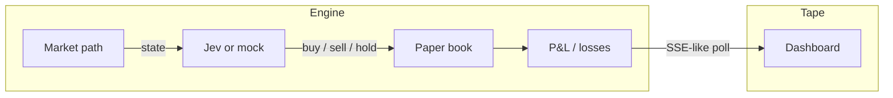

<p align="center">
  <strong>jev-fund</strong>
</p>

<p align="center">
  Open-source <b>paper hedge fund</b>. Jev decides. The tape shows holdings, buys, and losses.
</p>

<p align="center">
  <a href="https://github.com/erboland/jev-fund/blob/main/LICENSE"></a>
  <a href="https://github.com/erboland/jev-fund/stargazers"></a>
  <a href="https://github.com/erboland/jev-fund/issues"></a>
  
  
  
  <a href="https://x.com/QinvestingAI"></a>
</p>

<p align="center">
  <a href="#disclaimer">Disclaimer</a> ·
  <a href="#demo">Demo</a> ·
  <a href="#quick-start">Quick start</a> ·
  <a href="#how-it-works">How it works</a> ·
  <a href="#related-work">Related work</a> ·
  <a href="#citation">Citation</a>
</p>

<p align="center">
  
</p>

# jev-fund

A proof of concept for an AI-powered **paper** hedge fund. [Jev](https://vercel.com/kb/guide/typesafe-jev-and-ai-sdk) (TypeSafe System One, via the Vercel AI SDK) answers buy / sell / hold on a $100k long-only book. The public page is a live tape — the same product pattern as [jev-trader](https://jev-trader.vercel.app/), for a fund instead of a Monad market-maker.

This project is for **educational and research purposes only**. It does not place live orders. It is not investment advice.

## Disclaimer

This software is a **research toy**. By using it you agree to the following:

- Not intended for real trading or investment
- No investment advice, solicitation, or performance guarantee
- Simulated prices and paper fills only — **losses are shown on purpose**
- Past (simulated) returns do not indicate future results
- The authors assume no liability for financial losses
- Consult a licensed advisor before investing real capital

Do not connect a brokerage, wallet, or private key to this repository.

## Demo

| | |
| --- | --- |
| Local | `npm run dev` → [http://127.0.0.1:43147](http://127.0.0.1:43147) |
| Dashboard | Holdings, buys, realized **losses**, equity curve, this-tick probabilities |
| Default model | Deterministic **mock** (no API key) |
| Optional model | `MODEL=jev` via Vercel AI Gateway / TypeSafe |

What you are looking at:

| Panel | Meaning |
| --- | --- |
| NAV / P&L | Mark-to-model value vs the $100k start, including losses |
| Equity | Paper NAV after each tick |
| This tick | Latest Jev (or mock) choice and probabilities |
| Holdings | Open lines, weight, unrealized P&L |
| Tape → Losses / Buys | Realized losing sells, and the buy blotter |

Every ~4 seconds the engine looks at one name in a 10-ticker universe, sizes a paper order, and prints the tape.

## Quick start

```bash
git clone https://github.com/erboland/jev-fund.git
cd jev-fund
npm install
cp .env.example .env.local
npm run dev
```

Open [http://127.0.0.1:43147](http://127.0.0.1:43147). No API keys required.

### Optional: real Jev

```bash
# .env.local
MODEL=jev
AI_GATEWAY_API_KEY=...          # or TYPESAFE_AI_API_KEY / Vercel OIDC
```

If Jev is unreachable, the fund falls back to mock so the page never goes blank.

### Scripts

| Command | |
| --- | --- |
| `npm run dev` | Dev server on port 43147 |
| `npm test` | Paper-fund checks (holdings, buys, and losses exist) |
| `npm run lint` | ESLint |
| `npm run build` | Production build |
| `npm start` | Serve the build on 43147 |

## How it works



1. A seeded factor model walks prices for a small liquid universe.
2. Each tick, one name is scored: momentum, inventory, and (optionally) Jev `experimental_evaluate`.
3. Buys are capped at ~8% of NAV per clip and ~22% per name. Sells realize P&L, including losses.
4. The Next.js page polls `/api/fund` and renders the book in public.

### Universe

| Ticker | Name |
| --- | --- |
| AAPL | Apple |
| MSFT | Microsoft |
| NVDA | NVIDIA |
| GOOGL | Alphabet |
| AMZN | Amazon |
| META | Meta |
| TSLA | Tesla |
| JPM | JPMorgan |
| SPY | S&P 500 ETF |
| TLT | 20Y Treasury |

## Layout

```
src/lib/fund.ts       paper book, fills, P&L
src/lib/model.ts      mock + Jev (`experimental_evaluate`)
src/lib/runtime.ts    in-memory live loop
src/app/api/fund    snapshot JSON
src/components/       dashboard
docs/assets/          README screenshots
docs/launch/          X, Hacker News, Reddit copy
```

## Related work

Educational AI / quant open source this repo sits next to (not affiliated):

| Project | Why look at it |
| --- | --- |
| [virattt/ai-hedge-fund](https://github.com/virattt/ai-hedge-fund) | Multi-agent AI fund (CLI). Jev is now a supported model. |
| [jarrodwatts/jev-trader](https://github.com/jarrodwatts/jev-trader) | Live public tape; one Jev decision per Monad block. |
| [TauricResearch/TradingAgents](https://github.com/TauricResearch/TradingAgents) | LLM trading-firm agents + paper. |
| [microsoft/qlib](https://github.com/microsoft/qlib) | AI-oriented quant investment platform. |

**jev-fund** is the *watchable paper book*: a browser, a blotter, and honest losses. It is not a backtester, not a broker, and not QInvesting's production engine.

Built as an open artifact of [QInvesting](https://qinvesting.ai). Follow [**@QinvestingAI**](https://x.com/QinvestingAI).

## Deploy

Any Node host that can keep a process warm (so the in-memory book keeps ticking). On Vercel the book rebuilds on cold start from the same seeded history, then continues per isolate.

## Contributing

See [CONTRIBUTING.md](CONTRIBUTING.md). Please keep PRs small. Paper P&L must stay honest — do not hide losing sells from the Losses tape.

## Citation

If this tape is useful in a write-up, please cite the repository:

```bibtex
@software{karshyga2026jevfund,
  author  = {Karshyga, Yerbol},
  title   = {jev-fund: an open-source paper hedge fund},
  year    = {2026},
  url     = {https://github.com/erboland/jev-fund},
  license = {MIT}
}
```

Also see [CITATION.cff](CITATION.cff).

## Star history

[](https://star-history.com/#erboland/jev-fund&Date)

## License

[MIT](LICENSE). Not affiliated with TypeSafe, Vercel, or the authors of jev-trader / ai-hedge-fund beyond using public APIs and the same research pattern.
